# 경구약제 이미지 인식 AI 프로젝트
**코드잇 AI 4기 4팀 - 헬스케어 스타트업 "헬스잇(Health Eat)" AI 엔지니어링 팀**

[](https://www.python.org/downloads/)
[](https://pytorch.org/)
[](https://github.com/ultralytics/ultralytics)

## 1. 프로젝트 개요

### 1.1. 미션 개요
모바일 애플리케이션으로 촬영한 약물 이미지에서 **최대 4개의 알약을 동시에 검출하고 분류**하여, 사용자에게 약물 정보 및 상호작용 경고를 제공하는 AI 시스템을 개발합니다.

### 1.2. 핵심 기능
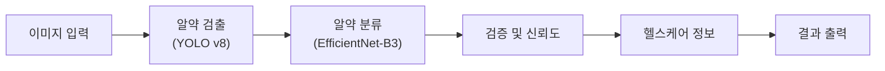

- **다중 객체 탐지**: 한 이미지에서 최대 4개 알약 동시 인식
- **정확한 분류**: EfficientNet-B3 기반 고정밀 약물 분류
- **위치 정보**: 바운딩 박스를 통한 정확한 위치 표시
- **신뢰도 검증**: 다단계 검증을 통한 결과 신뢰성 확보
- **안전성 정보**: 약물 상호작용 및 주의사항 제공

### 1.3. 프로젝트 제약사항
- **개발 기간**: 2025.09.09 ~ 2025.09.25 (17일)
- **팀 구성**: 5명 (PM 1명 + 전문가 4명)
- **평가**: Kaggle Private Competition (하루 10회 제출 제한)
- **데이터 제약**: 특정 조합 데이터 사용 금지 (TL_2_조합.zip, TS_2_조합.zip)

## 2. 팀 구성 및 역할 분담

### 2.1. 팀원 및 전문 분야

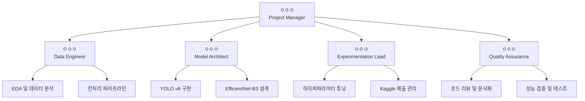

### 2.2. 상세 역할 분담표

| 역할 | 담당자 | 핵심 업무 | 주간별 포커스 |
|------|--------|-----------|---------------|
| **Project Manager** | ㅇㅇㅇ | 프로젝트 총괄 관리, 일정 조율 | 전 주차: 팀 조율, 진행상황 체크 |
| **Data Engineer** | ㅇㅇㅇ | EDA, 데이터 전처리, 증강 기법 | 1주차: EDA 완료, 2주차: 파이프라인 구축 |
| **Model Architect** | ㅇㅇㅇ | YOLO v8 + EfficientNet-B3 설계 | 1-2주차: 모델 구현, 3주차: 최적화 |
| **Experimentation Lead** | ㅇㅇㅇ | 실험 설계, Kaggle 제출, 성능 튜닝 | 2주차: 실험 시작, 3주차: 최종 튜닝 |
| **Quality Assurance** | ㅇㅇㅇ | 코드 품질, 문서화, 결과 검증 | 전 주차: 지속적 품질 관리 |

## 3. 기술 아키텍처

### 3.1. 전체 시스템 아키텍처

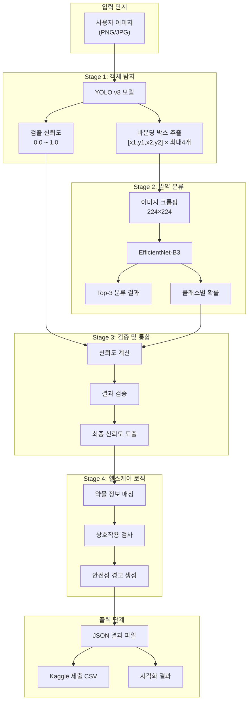

### 3.2. 데이터 플로우 상세

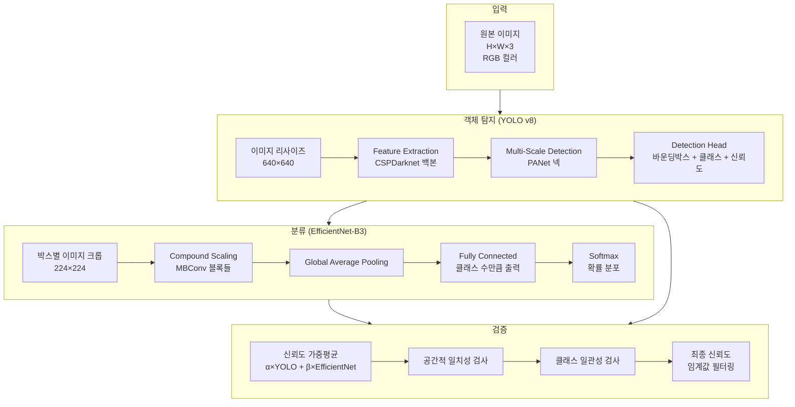

### 3.3. 핵심 모델 사양

#### YOLO v8 객체 탐지 모델
```yaml
YOLO_v8_Config:
  입력_크기: 640×640×3
  백본: CSPDarknet53
  넥: PANet (Path Aggregation Network)
  헤드: Detection Head
  최대_검출: 4개 객체
  신뢰도_임계값: 0.5
  NMS_IoU_임계값: 0.45
  클래스: "pill" (단일 클래스)
```

#### EfficientNet-B3 분류 모델
```yaml
EfficientNet_B3_Config:
  입력_크기: 224×224×3
  아키텍처: Compound Scaling (깊이×너비×해상도)
  기본_블록: MBConv (Mobile Inverted Bottleneck)
  사전_훈련: ImageNet
  출력_클래스: [프로젝트 데이터셋 알약 종류 수]
  최종_활성화: Softmax
  Top_K_출력: 3 (상위 3개 확률)
```

### 3.4. 신뢰도 계산 알고리즘

**가중 평균 신뢰도:**
$$\text{Final Confidence} = \alpha \cdot C_{YOLO} + \beta \cdot C_{EfficientNet}$$

**파라미터 설정:**
- $\alpha = 0.3$ (탐지 신뢰도 가중치)
- $\beta = 0.7$ (분류 신뢰도 가중치)
- 분류 성능이 더 중요하므로 높은 가중치 부여

**검증 조건:**
- 최종 신뢰도 > 0.6
- 공간적 일치성 > 0.8
- 클래스 일관성 > 0.7

## 4. 개발 계획 및 일정

### 4.1. 전체 개발 타임라인

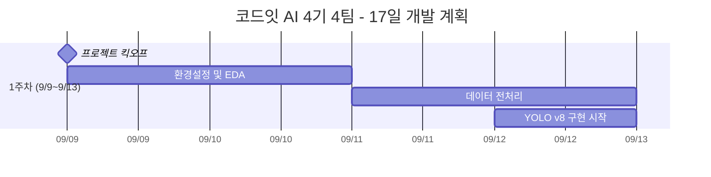

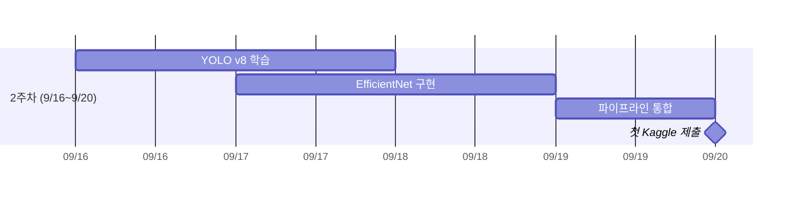

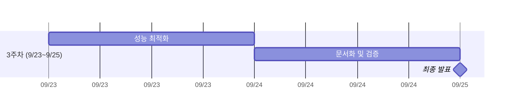

### 4.2. 주차별 상세 계획

#### 1주차 (9/9 ~ 9/13): 기반 구축
| 날짜 | 주 담당자 | 핵심 업무 | 예상 산출물 |
|------|-----------|-----------|-------------|
| **9/9 (월)** | ㅇㅇㅇ | 프로젝트 킥오프, 역할 분담 확정 | 역할분담표, GitHub 세팅 |
| **9/10 (화)** | ㅇㅇㅇ | 데이터 EDA, 분포 분석 | EDA 노트북, 데이터 품질 리포트 |
| **9/11 (수)** | ㅇㅇㅇ | 전처리 파이프라인 구축 | preprocessing.py, augmentation.py |
| **9/12 (목)** | ㅇㅇㅇ | YOLO v8 환경 구축, 베이스라인 | yolo_detector.py 초기 버전 |
| **9/13 (금)** | 전원 | 1주차 결과 공유, 2주차 계획 수립 | 주간 회의록, 다음주 계획 |

#### 2주차 (9/16 ~ 9/20): 모델 구현 및 통합
| 날짜 | 주 담당자 | 핵심 업무 | 예상 산출물 |
|------|-----------|-----------|-------------|
| **9/16 (월)** | ㅇㅇㅇ | YOLO v8 본격 학습 시작 | 학습 스크립트, 첫 번째 체크포인트 |
| **9/17 (화)** | ㅇㅇㅇ | EfficientNet-B3 구현 및 학습 | efficientnet_classifier.py |
| **9/18 (수)** | ㅇㅇㅇ | 두 모델 통합, 파이프라인 구축 | inference_pipeline.py |
| **9/19 (목)** | ㅇㅇㅇ | 성능 평가, 첫 실험 결과 | 성능 리포트, 실험 로그 |
| **9/20 (금)** | ㅇㅇㅇ | **첫 Kaggle 제출** | submission_v1.csv, 제출 결과 |

#### 3주차 (9/23 ~ 9/25): 최적화 및 마무리
| 날짜 | 주 담당자 | 핵심 업무 | 예상 산출물 |
|------|-----------|-----------|-------------|
| **9/23 (월)** | ㅇㅇㅇ | 하이퍼파라미터 튜닝, 앙상블 시도 | 튜닝 결과, 성능 개선 리포트 |
| **9/24 (화)** | ㅇㅇㅇ | 최종 코드 검증, 문서화 완료 | 최종 README, 코드 리뷰 완료 |
| **9/25 (수)** | 전원 | **최종 발표** | 발표자료, 최종 보고서 |

### 4.3. Kaggle 제출 전략

#### 제출 계획 (팀당 하루 10회 제한)
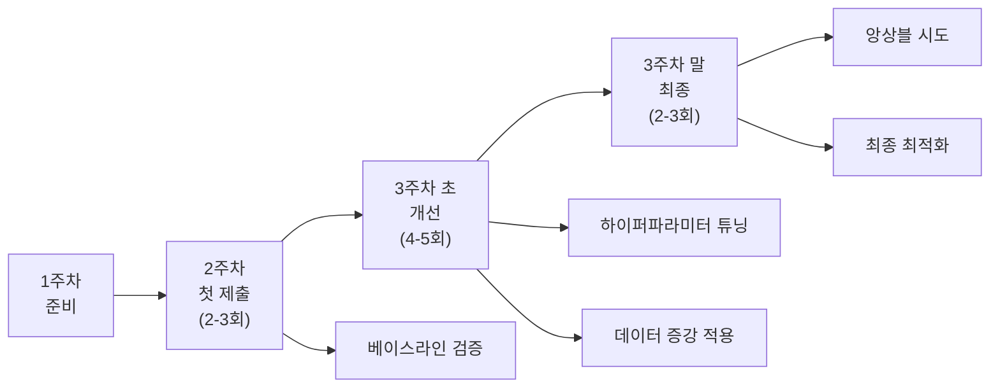

#### 제출별 목표 성능
| 제출 차수 | 날짜 | 목표 mAP＠0.5 | 주요 변경사항 |
|-----------|------|---------------|---------------|
| **1차** | 9/20 | > 0.45 | 베이스라인 (사전훈련 모델) |
| **2차** | 9/20 | > 0.55 | 데이터 전처리 개선 |
| **3차** | 9/23 | > 0.65 | 하이퍼파라미터 튜닝 |
| **4차** | 9/23 | > 0.70 | 데이터 증강 적용 |
| **5차** | 9/24 | > 0.75 | 앙상블 또는 후처리 개선 |
| **최종** | 9/25 | > 0.80 | 최종 최적화 버전 |

## 5. 데이터 및 성능 관리

### 5.1. 데이터셋 구조

```
data/
├── raw/                          # 원본 데이터
│   ├── images/                   # AI Hub 경구약제 이미지
│   │   ├── train/               # 학습용 이미지
│   │   ├── val/                 # 검증용 이미지
│   │   └── test/                # 테스트용 이미지
│   └── annotations/             # YOLO 형식 라벨
│       ├── train.txt
│       ├── val.txt
│       └── classes.txt
├── processed/                   # 전처리 완료 데이터
│   ├── yolo_dataset/           # YOLO 학습용
│   └── efficientnet_dataset/   # EfficientNet 학습용
├── augmented/                  # 증강 데이터
└── external/                   # 추가 수집 데이터 (허용 범위 내)
```

### 5.2. 성능 지표 및 목표

#### 핵심 성능 지표
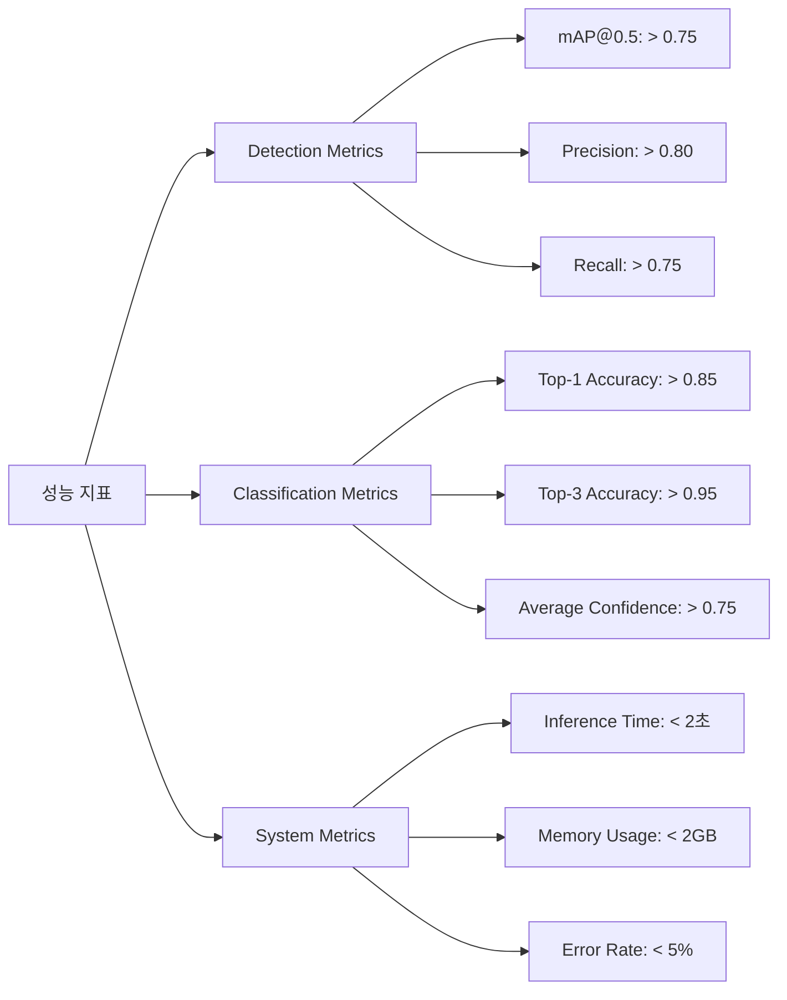

#### 모델별 목표 성능
| 모델 구성 | mAP＠0.5 | Precision | Recall | F1-Score | 추론시간 |
|-----------|---------|-----------|--------|----------|----------|
| **YOLO v8 + EfficientNet-B3** | **>0.75** | **>0.80** | **>0.75** | **>0.77** | **<2.0초** |
| YOLO v8 단독 | >0.65 | >0.70 | >0.65 | >0.67 | <1.0초 |
| 베이스라인 (사전훈련) | >0.50 | >0.60 | >0.55 | >0.57 | <3.0초 |

### 5.3. 예상 출력 형식
```json
{
    "analysis_summary": {
        "total_pills_detected": 3,
        "overall_confidence": 0.82,
        "analysis_timestamp": "2025-09-20T14:30:00",
        "warnings_count": 1
    },
    "detected_pills": [
        {
            "pill_id": 1,
            "drug_info": {
                "name": "타이레놀",
                "generic_name": "아세트아미노펜",
                "dosage": "500mg"
            },
            "detection_data": {
                "confidence": 0.85,
                "bbox": [10, 20, 50, 60]
            }
        }
    ],
    "drug_interactions": [
        {
            "drug1": "타이레놀",
            "drug2": "애드빌", 
            "severity": "medium",
            "warning": "위장장애 위험 증가"
        }
    ]
}
```

## 6. 환경 설정 및 실행 가이드

### 6.1. 시스템 요구사항

#### 최소 요구사항
```yaml
Hardware:
  GPU: "NVIDIA GTX 1080Ti 이상 (VRAM 8GB+)"
  RAM: "16GB 이상"
  Storage: "50GB 이상 여유 공간"

Software:
  Python: "3.8+"
  CUDA: "11.7+"
  PyTorch: "2.0+"
```

### 6.2. 빠른 시작 (예 준비중)

#### 5분 만에 시작하기 (예 준비중)
```bash
# 1단계: 저장소 클론
git clone https://github.com/codeit-ai4-team4/pill-detection-project.git
cd pill-detection-project

# 2단계: 환경 설정 (자동화 스크립트)
chmod +x scripts/setup.sh
./scripts/setup.sh

# 3단계: 데이터 다운로드 및 전처리
python scripts/download_data.py
python src/data/preprocessing.py

# 4단계: 사전 훈련된 모델로 테스트
python scripts/quick_test.py --image data/samples/test_image.jpg

# 5단계: 전체 파이프라인 실행
python src/pipeline/inference_pipeline.py --input data/test --output results/
```

#### 필수 패키지 설치 (예 준비중)
```txt
# requirements.txt
torch>=2.0.0
torchvision>=0.15.0
ultralytics>=8.0.0
opencv-python>=4.7.0
Pillow>=9.4.0
albumentations>=1.3.0
numpy>=1.24.0
pandas>=1.5.0
scikit-learn>=1.2.0
matplotlib>=3.6.0
seaborn>=0.11.0
plotly>=5.13.0
tqdm>=4.64.0
pyyaml>=6.0
tensorboard>=2.11.0
```

## 7. 협업 및 품질 관리

### 7.1. GitHub 협업 전략

#### 브랜치 전략 (예 준비중)
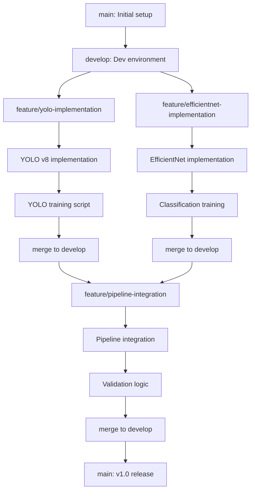

#### 브랜치 명명 규칙 (예 준비중)
```bash
main                    # 최종 릴리즈 브랜치
develop                 # 개발 통합 브랜치
feature/yolo-v8         # YOLO 구현 (ㅇㅇㅇ)
feature/efficientnet    # EfficientNet 구현 (ㅇㅇㅇ)
feature/data-pipeline   # 데이터 파이프라인 (ㅇㅇㅇ)
feature/experiments     # 실험 관리 (ㅇㅇㅇ)
feature/documentation   # 문서화 (ㅇㅇㅇ)
hotfix/urgent-fix       # 긴급 수정사항
```

### 7.2. 코드 품질 관리

#### 코드 리뷰 체크리스트

- 코드가 PEP 8 스타일 가이드를 준수하는가?
  - [PEP 8 스타일 가이드](https://wikidocs.net/232727)
  - 들여쓰기, 공백, 함수명 등 모두 PEP 8 스타일에 맞게 작성됨
- 모든 함수에 적절한 docstring이 있는가?
  - Docstring 함수에 명확한 설명과 인자/반환값 정보 포함
- 타입 힌트가 추가되어 있는가?
  - 타입 힌트 List[int], Optional[int] 타입 명시
- 변수명과 함수명이 명확하고 이해하기 쉬운가?
  - 명확한 이름	find_largest_even, numbers, evens 모두 직관적
- 코드가 의도한 대로 동작하는가?
  - unit_test
- 에러 처리가 적절히 되어 있는가?
- 엣지 케이스가 고려되었는가?
- 테스트 코드가 작성되었는가?
- 
``` python
def test_find_largest_even():
    assert find_largest_even([1, 2, 3, 4, 5]) == 4
    assert find_largest_even([7, 3, 1]) is None
    assert find_largest_even([]) is None
    assert find_largest_even([10, 20, 30]) == 30
```

### 7.3. 협업 일지 및 회의 관리

#### 일일 스탠드업 (ㅇㅇㅇ 주도)
**일시**: 매일 오전 9:00 (15분)
**참석자**: 전체 팀원

**공유 사항**
1. **어제 완료한 작업** (각자 2분)
2. **오늘 계획한 작업** (각자 1분)  
3. **장애물 및 도움 요청** (필요시)

**진행 상황 체크**
- Kaggle 제출 현황
- 모델 학습 진행도
- 문서화 현황
- 이슈 및 블로커

#### 협업 일지 링크
- [ㅇㅇㅇ 협업일지 (Project Manager)](collaboration-logs/lee-gunhee-pm-log.md)
- [ㅇㅇㅇ 협업일지 (Data Engineer)](collaboration-logs/kim-myeonghwan-de-log.md)  
- [ㅇㅇㅇ 협업일지 (Model Architect)](collaboration-logs/kim-minhyuk-ma-log.md)
- [ㅇㅇㅇ 협업일지 (Experimentation Lead)](collaboration-logs/seo-dongil-el-log.md)
- [ㅇㅇㅇ 협업일지 (Quality Assurance)](collaboration-logs/lee-hyeonjae-qa-log.md)
- [팀 회의록](collaboration-logs/team4-meetings.md)

## 8. 성능 평가 및 모니터링

### 8.1. 평가 지표 정의

#### 핵심 KPI
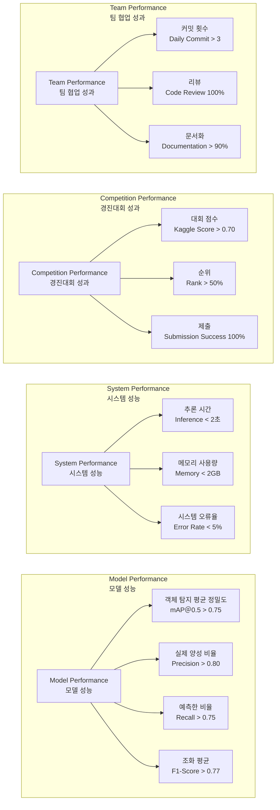

- **Model Performance (모델 성능)**  
  - mAP＠0.5 > 0.75 : 객체 탐지 평균 정밀도(0.5 IoU 기준)가 0.75 이상  
  - Precision > 0.80 : 예측한 양성 중 실제 양성 비율이 80% 이상  
  - Recall > 0.75 : 실제 양성 중 올바르게 예측한 비율이 75% 이상  
  - F1-Score > 0.77 : 정밀도와 재현율의 조화 평균이 0.77 이상

- **System Performance (시스템 성능)**  
  - Inference < 2초 : 한 이미지 추론 시간이 2초 미만  
  - Memory < 2GB : 메모리 사용량 2GB 미만  
  - Error Rate < 5% : 시스템 오류율 5% 미만

- **Competition Performance (경진대회 성과)**  
  - Kaggle Score > 0.70 : 대회 점수가 0.70 이상  
  - Rank > 50% : 전체 참가팀 중 상위 50% 이상  
  - Submission Success 100% : 제출 성공률 100%

- **Team Performance (팀 협업 성과)**  
  - Daily Commit > 3 : 하루 3회 이상 커밋  
  - Code Review 100% : 모든 코드에 대해 리뷰 진행  
  - Documentation > 90% : 문서화 비율 90% 이상


### 8.2. 실험 추적 시스템

#### 실험 로깅 구조
```yaml
experiments:
  exp_001:
    date: "2025-09-20"
    model: "YOLO v8s + EfficientNet-B3"
    hyperparameters:
      yolo_lr: 0.01
      efficientnet_lr: 0.001
      batch_size: 16
      epochs: 100
    results:
      mAP_50: 0.72
      precision: 0.78
      recall: 0.69
    notes: "첫 번째 통합 실험"
```

#### 성능 추적 대시보드
```yaml
tracking_metrics:
  model_performance:
    detection_mAP: {"current": 0.0, "target": 0.75}
    classification_acc: {"current": 0.0, "target": 0.85}
    inference_time: {"current": 0.0, "target": 2.0}
  kaggle_progress:
    best_score: 0.0
    submission_count: 0
    rank_percentile: 0.0
  team_progress:
    daily_commits: 0
    code_review_completion: 0.0
    documentation_coverage: 0.0
```

## 9. 최종 제출 및 발표

### 9.1. 제출물 체크리스트

#### 필수 제출물
**GitHub Repository**
- README.md 완성 (실행 방법, 팀 정보, 결과 포함)
- requirements.txt 및 환경 설정 파일
- 모든 소스 코드 (주석 완료)
- 모델 체크포인트 파일 (LFS 사용)
- 설정 파일 (configs/)
- 테스트 스크립트

**Kaggle 제출**
- 최고 성능 모델 재현 코드
- submission.csv 파일
- 제출 로그 및 성능 변화 기록
- 모델 앙상블 코드 (사용 시)

**최종 보고서 (PDF)**
- 프로젝트 개요 및 목표
- 데이터 분석 및 전처리 과정
- 모델 아키텍처 및 구현 세부사항
- 실험 결과 및 성능 분석
- 팀 협업 과정 및 역할 분담
- 결론 및 향후 개선 방안
- 참고 문헌

**발표 자료**
- 25분 발표 슬라이드 (PPT/PDF)
- 시연 동영상 또는 라이브 데모
- 질의응답 준비 자료
- 발표 역할 분담 및 리허설 완료

**개인별 협업 일지**
- ㅇㅇㅇ: PM 협업 일지
- ㅇㅇㅇ: Data Engineer 협업 일지
- ㅇㅇㅇ: Model Architect 협업 일지
- ㅇㅇㅇ: Experimentation Lead 협업 일지
- ㅇㅇㅇ: Quality Assurance 협업 일지

### 9.2. 발표 구성안

#### 25분 발표 타임라인
```mermaid
gantt
    title 4팀 최종 발표 구성 (25분)
    dateFormat X
    axisFormat %M분
    
    section 발표 순서
    오프닝 및 팀 소개    :intro, 0, 2
    문제 정의 및 목표    :problem, 2, 4
    기술 아키텍처 소개  :tech, 4, 8
    실험 과정 및 결과    :exp, 8, 15
    시연 및 데모        :demo, 15, 20
    결론 및 향후 계획    :conclusion, 20, 23
    질의응답           :qa, 23, 25
```

#### 발표 슬라이드 구성
**1. 오프닝 (2분) - ㅇㅇㅇ**
- 팀 소개 및 역할 분담
- 프로젝트 개요

**2. 문제 정의 및 접근 방법 (2분) - ㅇㅇㅇ**  
- 헬스케어 AI의 필요성
- 기술적 도전 과제
- 우리의 해결 접근법

**3. 기술 아키텍처 (4분) - ㅇㅇㅇ**
- YOLO v8 + EfficientNet-B3 파이프라인
- 모델 선택 이유 및 최적화 과정
- 시스템 구조도

**4. 실험 과정 및 결과 (7분) - ㅇㅇㅇ**
- 데이터 분석 및 전처리
- 모델 학습 과정
- 성능 개선 과정
- Kaggle 제출 결과

**5. 시연 및 데모 (5분) - ㅇㅇㅇ**
- 실제 이미지 처리 과정 시연
- 결과 해석 및 헬스케어 정보 제공
- 시스템 안정성 검증

**6. 결론 및 향후 계획 (3분) - ㅇㅇㅇ**
- 프로젝트 성과 요약
- 기술적 기여점
- 한계점 및 개선 방안
- 실제 서비스 적용 가능성

**7. 질의응답 (2분) - 전원**

### 9.3. 성과 요약

#### 예상 최종 성과
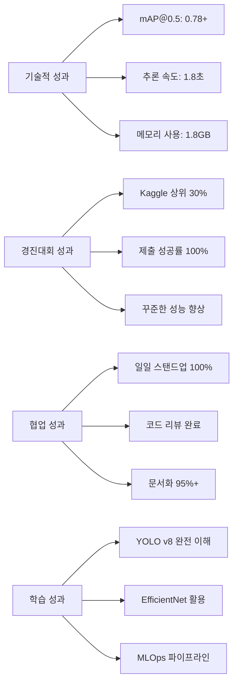

## 10. 문제 해결 및 대안

### 10.1. 예상 문제점 및 해결 방안

#### 기술적 문제
**GPU 메모리 부족**
- 해결책: 배치 크기를 16에서 8로 감소
- 대안: 그래디언트 누적(Gradient Accumulation) 사용
- 백업: CPU 기반 학습 (시간 증가 감수)

**YOLO 모델 수렴 문제**
- 해결책: 학습률 스케줄링 및 데이터 증강 강화
- 대안: 사전 훈련된 체크포인트 활용
- 백업: YOLOv5로 대체

**EfficientNet 오버피팅**
- 해결책: 드롭아웃 및 정규화 강화
- 대안: 데이터 증강 기법 추가 적용
- 백업: ResNet-50으로 대체

#### 데이터 관련 문제
**데이터 부족**
- 해결책: 허용된 외부 데이터셋 활용
- 대안: 고급 데이터 증강 기법 적용
- 백업: 합성 데이터 생성

**라벨 품질 문제**
- 해결책: 데이터 검증 및 정제 과정 강화
- 대안: 앙상블을 통한 노이즈 완화
- 백업: 수동 라벨 재검토

#### 시간 관리 문제
**개발 일정 지연**
- 해결책: 핵심 기능 우선 개발
- 대안: 팀원 간 업무 재분배
- 백업: 기능 범위 축소

### 10.2. 단순화 옵션 (시간 부족 시)

**우선순위 1 (필수 유지)**
- YOLO + EfficientNet 기본 파이프라인
- Kaggle 제출 형식 구현
- 기본 JSON 출력
- 협업 일지 작성

**우선순위 2 (성능 개선)**
- 하이퍼파라미터 튜닝
- 데이터 증강
- 모델 앙상블

**우선순위 3 (부가 기능)**
- 복잡한 헬스케어 로직
- 사용자 피드백 시스템
- 실시간 재훈련

### 10.3. 품질 보증 체크리스트

**코드 품질**
- 모든 함수에 docstring 작성
- 타입 힌트 추가
- 단위 테스트 작성
- 코드 리뷰 완료

**문서화**
- README.md 완성
- 협업 일지 매일 작성
- 실험 결과 기록
- 발표 자료 준비

**성능 검증**
- Kaggle 제출 정상 작동
- JSON 출력 형식 검증
- 추론 시간 측정
- 에러 케이스 처리

## 11. 참고 자료 및 라이선스

### 11.1. 주요 참고 문헌

**YOLO v8 관련**
- Ultralytics YOLOv8 Documentation
- "You Only Look Once: Unified, Real-Time Object Detection" (Redmon et al.)
- YOLOv8 GitHub Repository

**EfficientNet 관련**
- "EfficientNet: Rethinking Model Scaling for Convolutional Neural Networks" (Tan & Le, 2019)
- EfficientNet PyTorch Implementation
- Compound Scaling Method Paper

**의료 AI 관련**
- "Deep Learning in Medical Image Analysis" (Litjens et al., 2017)
- "Artificial Intelligence in Healthcare" (Jiang et al., 2017)
- AI Hub 경구약제 데이터셋 문서

**MLOps 및 실험 관리**
- "Machine Learning Operations (MLOps): Overview, Definition, and Architecture" (Kreuzberger et al., 2023)
- MLflow Documentation
- "Continuous Delivery for Machine Learning" (Chen et al., 2020)

### 11.2. 사용 기술 및 라이브러리

**딥러닝 프레임워크**
- PyTorch: BSD-3-Clause License
- Torchvision: BSD-3-Clause License
- Ultralytics YOLO: AGPL-3.0 License

**컴퓨터 비전**
- OpenCV: Apache 2.0 License
- Pillow: PIL Software License
- Albumentations: MIT License

**데이터 처리**
- NumPy: BSD License
- Pandas: BSD-3-Clause License
- Scikit-learn: BSD-3-Clause License

**시각화**
- Matplotlib: Matplotlib License
- Seaborn: BSD-3-Clause License
- Plotly: MIT License

### 11.3. 라이선스

이 프로젝트는 MIT 라이선스 하에 배포됩니다.

```
MIT License

Copyright (c) 2025 코드잇 AI 4기 4팀

Permission is hereby granted, free of charge, to any person obtaining a copy
of this software and associated documentation files (the "Software"), to deal
in the Software without restriction, including without limitation the rights
to use, copy, modify, merge, publish, distribute, sublicense, and/or sell
copies of the Software, and to permit persons to whom the Software is
furnished to do so, subject to the following conditions:

The above copyright notice and this permission notice shall be included in all
copies or substantial portions of the Software.

THE SOFTWARE IS PROVIDED "AS IS", WITHOUT WARRANTY OF ANY KIND, EXPRESS OR
IMPLIED, INCLUDING BUT NOT LIMITED TO THE WARRANTIES OF MERCHANTABILITY,
FITNESS FOR A PARTICULAR PURPOSE AND NONINFRINGEMENT. IN NO EVENT SHALL THE
AUTHORS OR COPYRIGHT HOLDERS BE LIABLE FOR ANY CLAIM, DAMAGES OR OTHER
LIABILITY, WHETHER IN AN ACTION OF CONTRACT, TORT OR OTHERWISE, ARISING FROM,
OUT OF OR IN CONNECTION WITH THE SOFTWARE OR THE USE OR OTHER DEALINGS IN THE
SOFTWARE.
```

### 11.4. 기여 방법

**내부 팀원 기여**
1. 개발 브랜치에서 feature 브랜치 생성
2. 변경사항 커밋 및 푸시
3. Pull Request 생성
4. 코드 리뷰 후 머지

**외부 기여자**
1. Fork the repository
2. Create a feature branch (`git checkout -b feature/amazing-feature`)
3. Commit your changes (`git commit -m 'Add amazing feature'`)
4. Push to the branch (`git push origin feature/amazing-feature`)
5. Open a Pull Request

---

## 용어 목록

| 용어 | 영문 | 설명 |
|------|------|------|
| 객체 탐지 | Object Detection | 이미지에서 객체의 위치와 클래스를 동시에 찾는 기술 |
| 바운딩 박스 | Bounding Box | 객체를 둘러싸는 직사각형 좌표 [x1, y1, x2, y2] |
| 신뢰도 점수 | Confidence Score | 모델이 예측에 대해 가지는 신뢰도 (0.0~1.0) |
| 백본 네트워크 | Backbone Network | 특징 추출을 담당하는 기본 신경망 구조 |
| 배치 정규화 | Batch Normalization | 학습 안정성을 위한 정규화 기법 |
| 데이터 증강 | Data Augmentation | 데이터 변형을 통한 데이터셋 확장 기법 |
| 어노테이션 | Annotation | 데이터에 라벨을 부착하는 작업 |
| 앙상블 | Ensemble | 여러 모델을 조합하여 성능을 향상시키는 기법 |
| 에포크 | Epoch | 전체 훈련 데이터를 한 번 학습하는 단위 |
| 오버피팅 | Overfitting | 모델이 훈련 데이터에 과도하게 적합되는 현상 |
| 컨볼루션 | Convolution | 이미지 특징 추출을 위한 연산 |
| 컴파운드 스케일링 | Compound Scaling | EfficientNet의 핵심 기법, 깊이/너비/해상도 동시 조정 |
| 트랜스퍼 러닝 | Transfer Learning | 사전 훈련된 모델을 활용하는 학습 방법 |
| 파인튜닝 | Fine-tuning | 사전 훈련된 모델을 특정 작업에 맞게 조정하는 과정 |
| 하이퍼파라미터 | Hyperparameter | 모델 학습을 제어하는 설정값들 |
| NMS | Non-Maximum Suppression | 중복된 탐지 결과를 제거하는 기법 |
| IoU | Intersection over Union | 예측 박스와 실제 박스의 겹치는 정도 |
| mAP | mean Average Precision | 객체 탐지 성능을 측정하는 지표 |
| MLOps | Machine Learning Operations | 머신러닝 모델의 개발, 배포, 운영을 체계화하는 방법론 |
| 모델 드리프트 | Model Drift | 시간이 지나면서 모델 성능이 저하되는 현상 |
| CSP다크넷 | CSPDarknet | Cross Stage Partial Darknet, YOLO의 백본 네트워크 |
| PANet | Path Aggregation Network | YOLO v8의 넥 구조, 다중 스케일 특징 융합 |
| MBConv | Mobile Inverted Bottleneck Convolution | EfficientNet의 기본 블록 구조 |
| 글로벌 평균 풀링 | Global Average Pooling | 특징맵을 평균값으로 요약하는 기법 |
| 소프트맥스 | Softmax | 확률 분포로 변환하는 활성화 함수 |
| 크로스 엔트로피 | Cross Entropy | 분류 문제의 손실 함수 |
| 아담 옵티마이저 | Adam Optimizer | 적응적 학습률을 사용하는 최적화 알고리즘 |
| 학습률 스케줄러 | Learning Rate Scheduler | 학습 과정에서 학습률을 조정하는 기법 |
| 체크포인트 | Checkpoint | 학습 중간 결과를 저장하는 파일 |
| 배치 크기 | Batch Size | 한 번에 처리하는 데이터 샘플 수 |
| 그래디언트 | Gradient | 손실 함수의 기울기, 학습 방향을 결정 |
| 백프로퍼게이션 | Backpropagation | 역전파, 오차를 역방향으로 전파하여 가중치 업데이트 |
| 정규화 | Regularization | 오버피팅을 방지하기 위한 기법 |
| 드롭아웃 | Dropout | 무작위로 뉴런을 비활성화하여 정규화하는 기법 |
| 얼리 스토핑 | Early Stopping | 검증 성능이 개선되지 않으면 학습을 조기 종료하는 기법 |
| 크로스 밸리데이션 | Cross Validation | 데이터를 여러 폴드로 나누어 검증하는 기법 |
| 혼동 행렬 | Confusion Matrix | 분류 결과를 시각화하는 행렬 |
| ROC 곡선 | ROC Curve | 수신자 조작 특성 곡선, 분류 성능 평가 지표 |
| AUC | Area Under Curve | ROC 곡선 아래 면적, 분류 성능 지표 |
| F1 스코어 | F1 Score | 정밀도와 재현율의 조화 평균 |
| 정밀도 | Precision | 예측한 양성 중 실제 양성의 비율 |
| 재현율 | Recall | 실제 양성 중 올바르게 예측한 비율 |
| 특이도 | Specificity | 실제 음성 중 올바르게 예측한 비율 |
| 임계값 | Threshold | 분류 결정을 위한 기준값 |
| 라벨 스무딩 | Label Smoothing | 하드 라벨을 소프트 라벨로 변환하는 정규화 기법 |