# 알약 분류 시스템 아키텍처 설계

## 1. 프로젝트 개요

### 1.1. 시스템 목적
모바일 애플리케이션에서 촬영한 알약 이미지를 서버로 전송하여 AI 기반 알약 분류 및 안전성 정보를 제공하는 헬스케어 시스템

### 1.2. 핵심 기능
- **1단계 (Phase 1)**: 알약 객체 탐지 및 분류
- **2단계 (Phase 2)**: 약물 상호작용 및 위험성 분석
- **3단계 (Phase 3)**: 웹 서버 구축 및 서비스화 (옵션)

### 1.3. 기술 스택
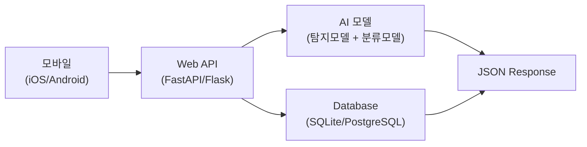

## 2. 전체 시스템 아키텍처

### 2.1. 시스템 개요도
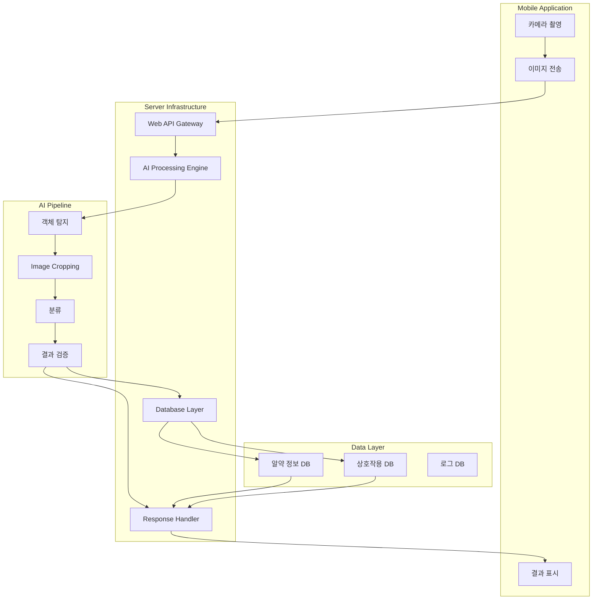

### 2.2. 데이터 플로우 다이어그램 (Data Flow Diagram)
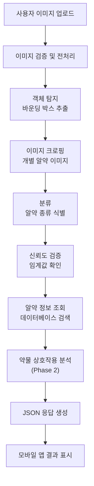

### 2.3. 네트워크 아키텍처
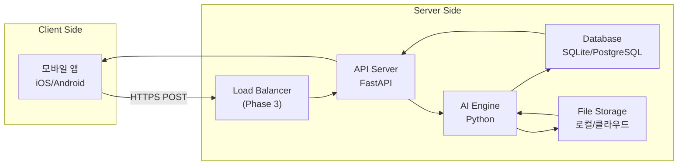

## 3. API 설계

### 3.1. RESTful API 엔드포인트
```yaml
Base URL: http://localhost:8000/api/v1

Endpoints:
  POST /pills/analyze
    - 이미지 업로드 및 분석
    - Content-Type: multipart/form-data
    
  GET /pills/{pill_id}
    - 특정 알약 정보 조회
    
  POST /pills/interactions
    - 여러 알약 상호작용 분석 (Phase 2)
    
  GET /health
    - 서버 상태 체크
```

### 3.2. API 요청/응답 형식

#### 3.2.1. 이미지 분석 요청 (POST /pills/analyze)
```http
POST /api/v1/pills/analyze HTTP/1.1
Content-Type: multipart/form-data
Authorization: Bearer {token}

--boundary123
Content-Disposition: form-data; name="image"; filename="pill_image.jpg"
Content-Type: image/jpeg

[이미지 바이너리 데이터]
--boundary123
Content-Disposition: form-data; name="options"
Content-Type: application/json

{
  "max_pills": 4,
  "confidence_threshold": 0.6,
  "include_interactions": true
}
```

#### 3.2.2. API 응답 형식 (Phase 1)
```json
{
  "status": "success",
  "timestamp": "2025-09-16T14:30:00Z",
  "request_id": "req_12345",
  "analysis_summary": {
    "total_pills_detected": 2,
    "processing_time_ms": 1800,
    "api_version": "1.0.0"
  },
  "detected_pills": [
    {
      "pill_id": 1,
      "detection_confidence": 0.95,
      "classification_confidence": 0.87,
      "bounding_box": {
        "x1": 120,
        "y1": 80,
        "x2": 180,
        "y2": 140
      },
      "drug_info": {
        "name": "타이레놀",
        "generic_name": "아세트아미노펜",
        "manufacturer": "한국얀센",
        "dosage": "500mg",
        "shape": "타원형",
        "color": "흰색",
        "identifier": "TYL500"
      }
    },
    {
      "pill_id": 2,
      "detection_confidence": 0.89,
      "classification_confidence": 0.92,
      "bounding_box": {
        "x1": 200,
        "y1": 150,
        "x2": 260,
        "y2": 210
      },
      "drug_info": {
        "name": "애드빌",
        "generic_name": "이부프로펜",
        "manufacturer": "화이자",
        "dosage": "200mg",
        "shape": "원형",
        "color": "주황색",
        "identifier": "IBU200"
      }
    }
  ],
  "metadata": {
    "model_versions": {
      "yolo_version": "8.0.1",
      "efficientnet_version": "b3-1.0"
    },
    "image_info": {
      "width": 1024,
      "height": 768,
      "format": "JPEG"
    }
  }
}
```

#### 3.2.3. 확장 응답 형식 (Phase 2 - 상호작용 포함)
```json
{
  "status": "success",
  "timestamp": "2025-09-16T14:30:00Z",
  "request_id": "req_12345",
  "analysis_summary": {
    "total_pills_detected": 2,
    "interaction_warnings": 1,
    "safety_level": "moderate_risk"
  },
  "detected_pills": [
    // ... 기존 pill 정보
  ],
  "drug_interactions": [
    {
      "interaction_id": "int_001",
      "involved_drugs": ["타이레놀", "애드빌"],
      "severity": "moderate",
      "interaction_type": "synergistic_toxicity",
      "description": "동시 복용 시 위장 장애 위험 증가",
      "recommendation": "4시간 간격으로 복용 권장",
      "clinical_significance": "moderate",
      "references": ["약학정보원", "FDA Guidelines"]
    }
  ],
  "safety_recommendations": {
    "overall_safety": "주의 필요",
    "specific_warnings": [
      "간 기능 저하 환자는 의사와 상담 필요",
      "장기 복용 시 정기 검진 권장"
    ],
    "dosage_guidelines": {
      "타이레놀": "1일 최대 4000mg을 초과하지 마세요",
      "애드빌": "식후 복용을 권장합니다"
    }
  }
}
```

### 3.3. 에러 응답 형식
```json
{
  "status": "error",
  "timestamp": "2025-09-16T14:30:00Z",
  "request_id": "req_12345",
  "error": {
    "code": "INVALID_IMAGE",
    "message": "업로드된 이미지가 유효하지 않습니다",
    "details": "지원되는 형식: JPEG, PNG (최대 10MB)",
    "suggestion": "다른 이미지로 다시 시도해주세요"
  }
}
```

## 4. 시스템 컴포넌트 설계

### 4.1. AI 처리 엔진 아키텍처

#### 4.1.2. AI 파이프라인 구조도
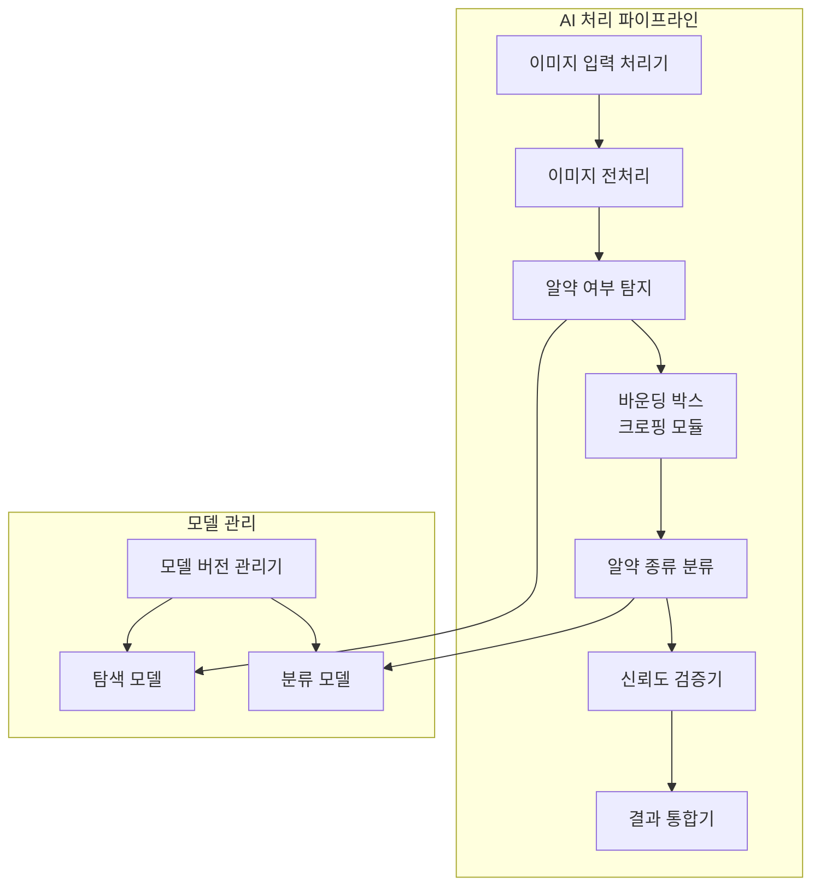

#### 4.1.3. 처리 단계별 상세 설명
1. **이미지 입력 처리기**: 업로드된 이미지 파일 검증 및 로딩
2. **이미지 전처리**: 크기 조정, 정규화, 텐서 변환
3. **알약 여부 탐지**: 이미지 내 알약 객체 탐지 및 바운딩 박스 생성
4. **바운딩 박스 크로핑**: 탐지된 각 알약을 개별 이미지로 분리
5. **알약 종류 분류**: 크롭된 알약 이미지에서 구체적인 약품 분류
6. **신뢰도 검증기**: 탐지 및 분류 결과의 신뢰도 검증
7. **결과 통합기**: 최종 결과 포맷팅 및 JSON 응답 생성

### 4.2. 데이터베이스 스키마 및 관계도

#### 4.2.2. 테이블 관계도
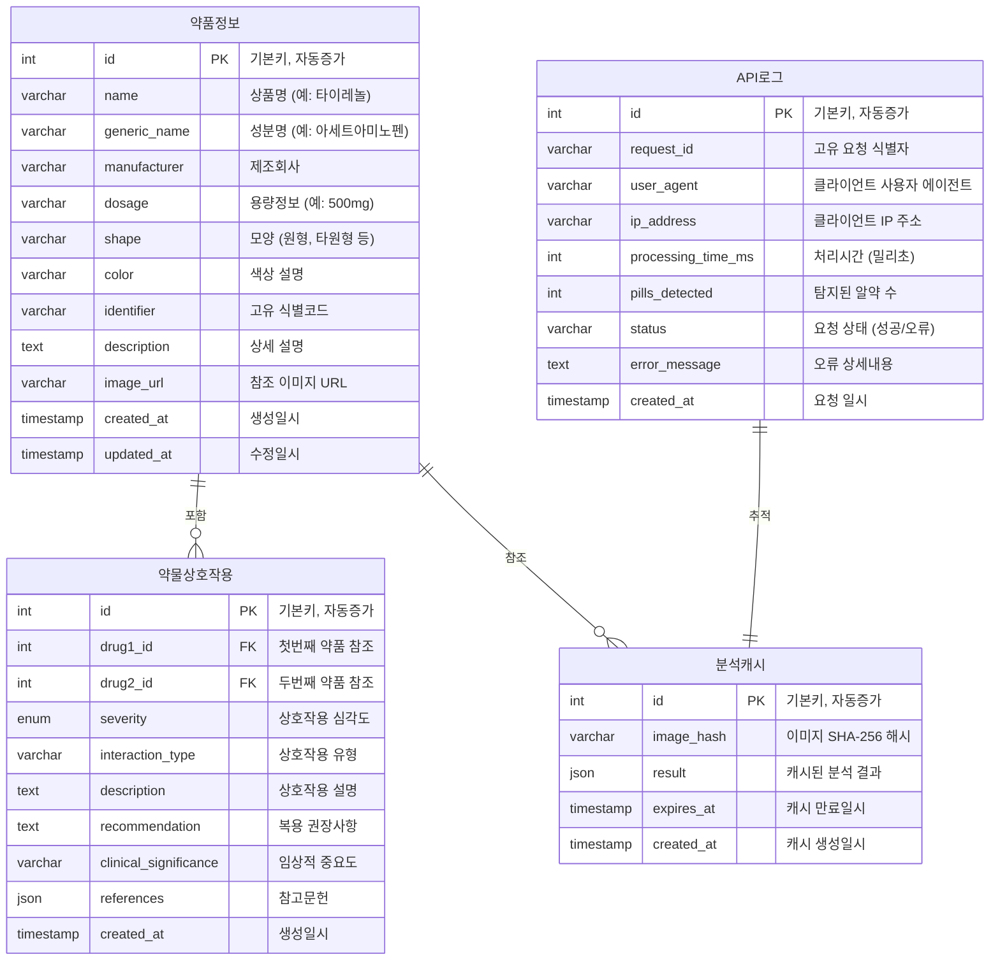

#### 4.2.3. 스키마 상세 설명

**pills 테이블 (약품정보)**
- `id`: 각 약품의 고유 식별자
- `name`: 상품명 (예: 타이레놀, 애드빌)
- `generic_name`: 성분명 (예: 아세트아미노펜, 이부프로펜)
- `manufacturer`: 제조회사명
- `dosage`: 용량 정보 (예: 500mg, 200mg)
- `shape`: 물리적 모양 (원형, 타원형, 캡슐형 등)
- `color`: 색상 정보 (흰색, 파란색, 빨간색 등)
- `identifier`: 약품 고유 식별 코드 (각인 정보)
- `description`: 약품에 대한 상세 설명
- `image_url`: 참조용 약품 이미지 URL
- `created_at/updated_at`: 데이터 관리용 타임스탬프

**drug_interactions 테이블 (약물상호작용)**
- `id`: 상호작용 정보의 고유 식별자
- `drug1_id/drug2_id`: 상호작용하는 두 약품의 외래키
- `severity`: 상호작용 심각도 (low, moderate, high, severe)
- `interaction_type`: 상호작용 유형 (금기, 주의, 모니터링)
- `description`: 상호작용에 대한 상세 설명
- `recommendation`: 복용 시 권장사항
- `clinical_significance`: 임상적 중요도
- `references`: 참고문헌 정보 (JSON 형태)

**api_logs 테이블 (API로그)**
- `id`: 로그 레코드의 고유 식별자
- `request_id`: 각 API 요청의 고유 추적 ID
- `user_agent`: 클라이언트 애플리케이션 정보
- `ip_address`: 요청자의 IP 주소 (보안 및 분석용)
- `processing_time_ms`: 요청 처리 시간 (성능 모니터링)
- `pills_detected`: 탐지된 알약 개수
- `status`: 요청 처리 상태 (success, error)
- `error_message`: 오류 발생 시 상세 메시지

**analysis_cache 테이블 (분석캐시)**
- `id`: 캐시 레코드의 고유 식별자
- `image_hash`: 이미지의 SHA-256 해시값 (중복 처리 방지)
- `result`: 분석 결과 전체를 JSON 형태로 저장
- `expires_at`: 캐시 만료 시점 (일정 시간 후 자동 삭제)
- `created_at`: 캐시 생성 시점

### 4.3. 서버 구성 요소
```python
# 핵심 서버 구조 (최소 코드)
from fastapi import FastAPI, UploadFile, HTTPException
from fastapi.middleware.cors import CORSMiddleware
import asyncio
import json

app = FastAPI(title="Pill Classification API", version="1.0.0")

# CORS 설정
app.add_middleware(
    CORSMiddleware,
    allow_origins=["*"],
    allow_methods=["GET", "POST"],
    allow_headers=["*"],
)

class PillAnalysisEngine:
    def __init__(self):
        self.yolo_model = self.load_yolo_model()
        self.efficientnet_model = self.load_efficientnet_model()
        self.database = self.init_database()
    
    async def analyze_image(self, image_file: UploadFile) -> dict:
        # 1단계: 이미지 검증
        validated_image = await self.validate_image(image_file)
        
        # 2단계: YOLO 객체 탐지
        detections = await self.detect_pills(validated_image)
        
        # 3단계: EfficientNet 분류
        classifications = await self.classify_pills(validated_image, detections)
        
        # 4단계: 결과 검증 및 DB 조회
        results = await self.validate_and_enrich(classifications)
        
        return self.format_response(results)

# API 엔드포인트
@app.post("/api/v1/pills/analyze")
async def analyze_pills(image: UploadFile):
    try:
        engine = PillAnalysisEngine()
        result = await engine.analyze_image(image)
        return result
    except Exception as e:
        raise HTTPException(status_code=400, detail=str(e))

@app.get("/api/v1/health")
async def health_check():
    return {"status": "healthy", "version": "1.0.0"}
```

## 5. 단계별 개발 계획

### 5.1. Phase 1: 기본 AI 분류 시스템 (필수)
```mermaid
gantt
    title Phase 1 개발 일정 (14일)
    dateFormat X
    axisFormat %d일
    
    section 환경 구축
    개발환경 설정    :setup, 0, 2
    데이터 준비     :setup, 1, 3
    
    section AI 모델
    YOLO 구현      :active, yolo, 3, 7
    EfficientNet   :effnet, 5, 9
    파이프라인 통합  :pipeline, 8, 11
    
    section API 개발
    FastAPI 구현   :api, 9, 12
    DB 연동       :db, 11, 13
    테스트        :test, 12, 14
```

**Phase 1 주요 목표:**
- YOLO v8 기반 알약 객체 탐지
- EfficientNet 기반 알약 분류
- 기본 Web API 구현
- SQLite 데이터베이스 연동
- JSON 형식 응답

### 5.2. Phase 2: 약물 상호작용 분석 (옵션)
```mermaid
gantt
    title Phase 2 개발 일정 (7일)
    dateFormat X
    axisFormat %d일
    
    section 데이터 확장
    상호작용 DB 구축  :db2, 0, 3
    
    section 로직 개발
    상호작용 엔진    :engine, 2, 5
    안전성 분석     :safety, 4, 6
    API 확장       :api2, 5, 7
```

**Phase 2 주요 목표:**
- 약물 상호작용 데이터베이스 구축
- 위험성 분석 로직 구현
- JSON 응답 확장
- 안전성 권고사항 제공

### 5.3. Phase 3: 웹 서버 및 서비스화 (옵션)
```mermaid
gantt
    title Phase 3 개발 일정 (7일)
    dateFormat X
    axisFormat %d일
    
    section 인프라
    웹서버 구축     :web, 0, 3
    로드밸런서     :lb, 2, 4
    
    section 운영
    모니터링       :monitor, 3, 5
    배포          :deploy, 4, 7
```

**Phase 3 주요 목표:**
- 웹 서버 구축 (Nginx + Gunicorn)
- 로드 밸런싱 및 확장성
- 모니터링 및 로깅 시스템
- 프로덕션 배포

## 6. 기술 스펙 및 요구사항

### 6.1. 시스템 요구사항
```yaml
하드웨어 요구사항:
  최소:
    CPU: "4 Core 이상"
    RAM: "8GB 이상"
    GPU: "NVIDIA GTX 1060 이상 (선택사항)"
    Storage: "50GB 이상"
  
  권장:
    CPU: "8 Core 이상"
    RAM: "16GB 이상"
    GPU: "NVIDIA RTX 3070 이상"
    Storage: "100GB SSD"

소프트웨어 요구사항:
  OS: "Ubuntu 20.04+ / Windows 10+ / macOS 12+"
  Python: "3.8+"
  CUDA: "11.7+ (GPU 사용 시)"
  Docker: "20.10+ (배포 시)"
```

### 6.2. 성능 기준
```yaml
응답 시간:
  이미지 분석: "< 3초"
  DB 조회: "< 500ms"
  API 응답: "< 5초"

정확도:
  객체 탐지: "mAP@0.5 > 0.75"
  분류 정확도: "> 0.85"
  전체 정확도: "> 0.80"

가용성:
  서버 가동률: "> 99%"
  동시 사용자: "100명"
  처리량: "10 requests/second"
```

### 6.3. 보안 고려사항
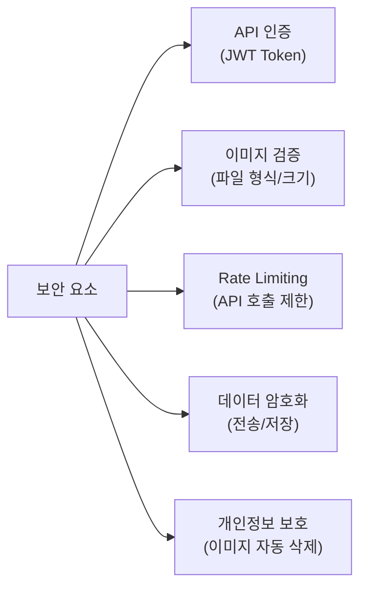

---
---

## 배포 및 운영 (실무 기준 설계 - 과제에서는 제외)

---
---

## 7. 배포 및 운영

### 7.1. 배포 아키텍처 (Phase 3)

#### 7.1.2. 배포 아키텍처
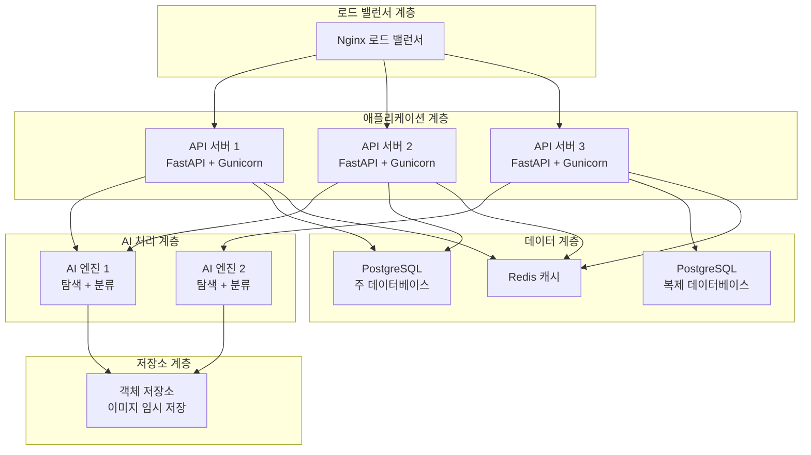

### 7.2. 모니터링 및 로깅

#### 7.2.2. 모니터링 및 로깅
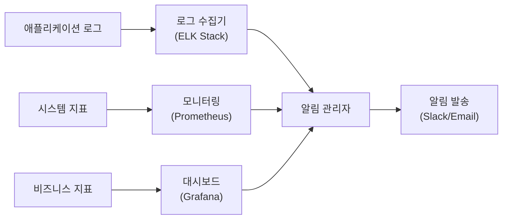

### 7.3. Docker 컨테이너 구성 (옵션)
```dockerfile
# 예시 Dockerfile (최소 코드)
FROM python:3.9-slim

WORKDIR /app

# 의존성 설치
COPY requirements.txt .
RUN pip install --no-cache-dir -r requirements.txt

# 소스 코드 복사
COPY src/ ./src/
COPY models/ ./models/

# 포트 노출
EXPOSE 8000

# 서버 실행
CMD ["uvicorn", "src.main:app", "--host", "0.0.0.0", "--port", "8000"]
```

## 8. 용어 목록

| 용어 | 의미 |
|------|------|
| Object Detection | 이미지에서 객체의 위치와 클래스를 동시에 찾는 기술 |
| Bounding Box | 객체를 둘러싸는 직사각형 좌표 |
| Confidence Score | 모델 예측의 신뢰도 점수 |
| API Gateway | 클라이언트와 백엔드 서비스 간의 중간 계층 |
| Load Balancer | 여러 서버에 요청을 분산하는 시스템 |
| RESTful API | HTTP 프로토콜을 이용한 웹 서비스 아키텍처 |
| JSON | 데이터 교환을 위한 경량 형식 |
| JWT Token | JSON Web Token, 안전한 정보 전송을 위한 토큰 |
| Rate Limiting | API 호출 횟수를 제한하는 기법 |
| Docker Container | 애플리케이션과 의존성을 패키징한 컨테이너 |
| Microservices | 작은 독립적인 서비스들로 구성된 아키텍처 |
| CORS | Cross-Origin Resource Sharing, 브라우저 보안 정책 |
| SSL/TLS | 데이터 전송 암호화 프로토콜 |
| Database Indexing | 데이터베이스 성능 향상을 위한 인덱스 |
| Caching | 자주 사용되는 데이터를 빠르게 접근할 수 있도록 저장 |