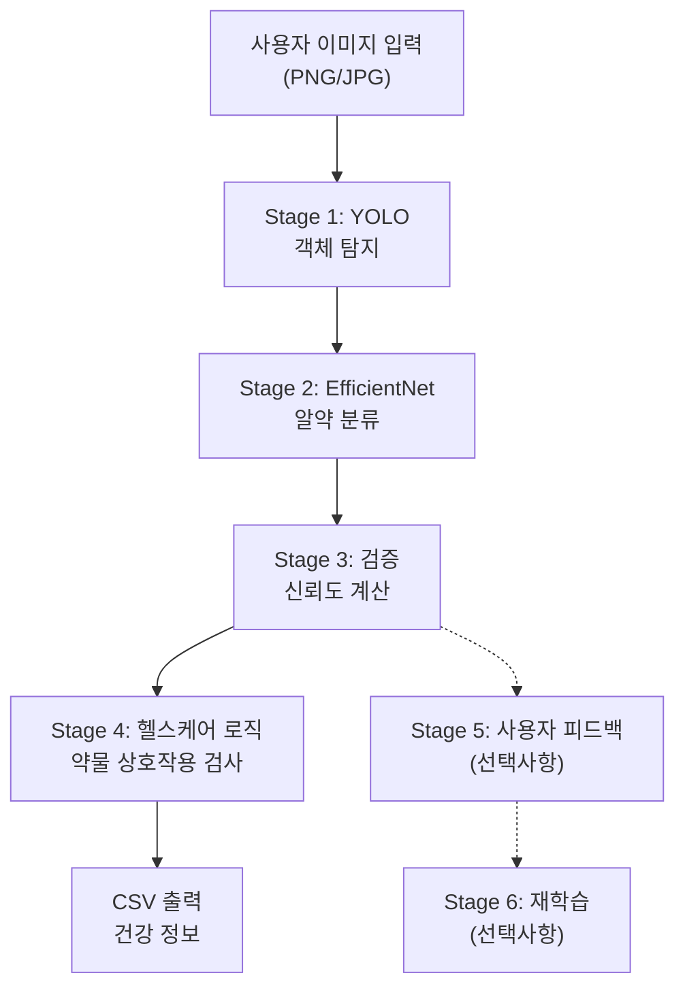
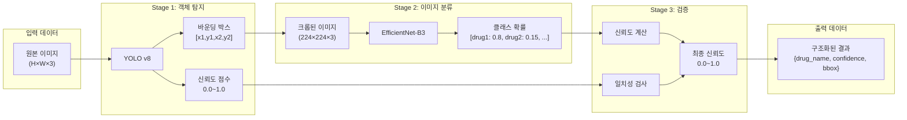
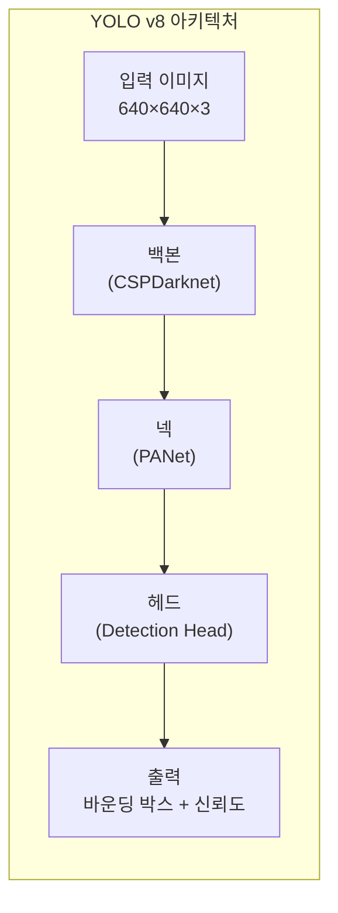
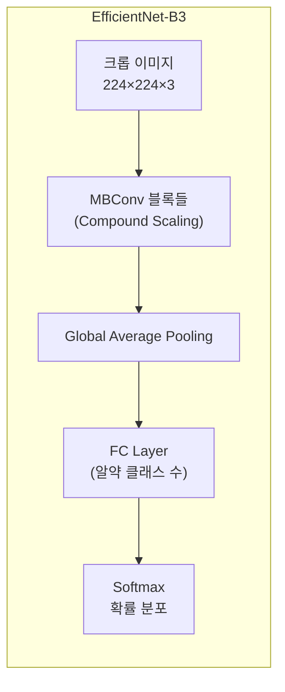
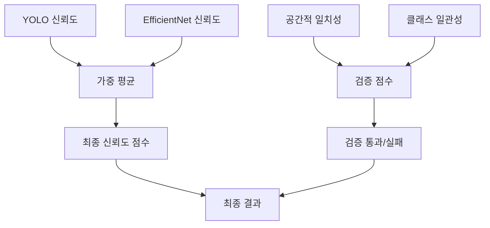
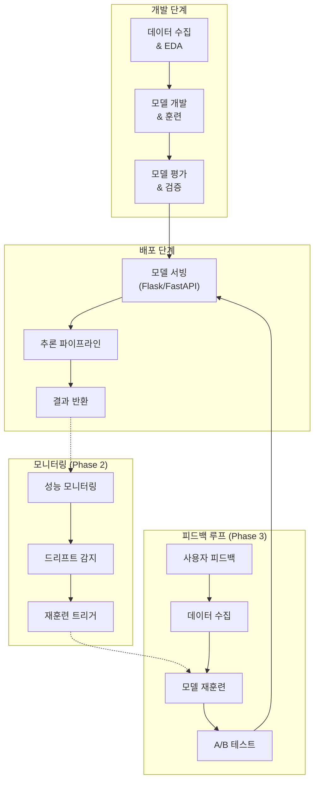
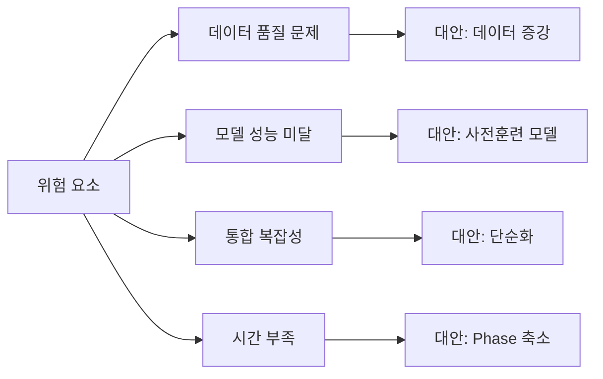

# 헬스케어 알약 인식 AI 시스템 설계 문서

## 1. 프로젝트 개요

### 1.1. 목표
- 모바일 애플리케이션으로 촬영한 알약 이미지에서 최대 4개의 알약을 검출하고 분류
- 검출된 알약 정보를 바탕으로 건강 정보 및 약물 상호작용 경고 제공
- 사용자 피드백을 통한 지속적 성능 개선 (선택사항)

### 1.2. 개발 제약사항
- **개발 기간**: 20일
- **팀 구성**: 4명 (PM, Data Engineer, Model Architect, Experimentation Lead)
- **배포 환경**: 로컬/단일 서버 (클라우드 배포는 선택사항)

## 2. 시스템 아키텍처

### 2.1. 전체 시스템 개요



### 2.2. 개발 단계별 우선순위

```mermaid
gantt
    title 20일 개발 계획
    dateFormat X
    axisFormat %d일차
    
    section Phase 1 (MVP)
    환경 설정 & 데이터 EDA     :done, p1-1, 0, 3
    YOLO 모델 개발           :done, p1-2, 2, 7
    EfficientNet 분류 모델   :active, p1-3, 5, 10
    검증 로직 & 파이프라인    :p1-4, 8, 12
    헬스케어 DB 구축         :p1-5, 10, 14
    
    section Phase 2 (개선)
    사용자 인터페이스        :p2-1, 13, 17
    피드백 시스템 (수집만)    :p2-2, 15, 18
    
    section Phase 3 (확장)
    지속적 학습 (선택)       :p3-1, 18, 20
```



## 3. 데이터 파이프라인

### 3.1. 데이터 플로우



### 3.2. 데이터 구조

#### 3.2.1. YOLO 출력 형식
```python
yolo_output = {
    "boxes": [[x1, y1, x2, y2], ...],  # 최대 4개
    "confidences": [0.95, 0.87, ...],
    "class_ids": [0, 0, ...]  # 모두 'pill' 클래스
}
```

#### 3.2.2. EfficientNet 출력 형식
```python
classification_output = {
    "pill_1": {
        "predictions": [
            {"drug_name": "아스피린", "confidence": 0.85},
            {"drug_name": "타이레놀", "confidence": 0.12},
            {"drug_name": "이부프로펜", "confidence": 0.03}
        ],
        "bbox": [x1, y1, x2, y2]
    }
}
```

#### 3.2.3. 최종 출력 형식 (CSV)
```csv
pill_id,drug_name,confidence,bbox,warnings,interactions
1,아스피린,0.85,"[10,20,50,60]","위장장애 주의","이부프로펜과 함께 복용 금지"
2,타이레놀,0.92,"[70,30,110,70]","간독성 주의","알코올과 함께 복용 금지"
```

## 4. 모델 아키텍처

### 4.1. Stage 1: YOLO v8 객체 탐지



**설정값:**
- **입력 크기**: 640×640 (YOLO 표준)
- **최대 검출 개수**: 4개
- **신뢰도 임계값**: 0.5
- **NMS IoU 임계값**: 0.45

### 4.2. Stage 2: EfficientNet-B3 분류



**설정값:**
- **입력 크기**: 224×224 (ImageNet 표준)
- **사전 훈련**: ImageNet 가중치 사용
- **출력 클래스**: 프로젝트 데이터셋의 고유 알약 수

### 4.3. Stage 3: 검증 및 신뢰도 계산



**신뢰도 계산 공식:**
$$\text{Final Confidence} = \alpha \cdot \text{YOLO Conf} + \beta \cdot \text{EfficientNet Conf}$$

여기서 $\alpha = 0.3, \beta = 0.7$ (분류 성능에 더 높은 가중치)

## 5. 데이터베이스 설계

### 5.1. SQLite 스키마

```sql
-- 약물 기본 정보
CREATE TABLE drugs (
    id INTEGER PRIMARY KEY,
    name TEXT NOT NULL,
    generic_name TEXT,
    manufacturer TEXT,
    dosage TEXT,
    description TEXT,
    created_at TIMESTAMP DEFAULT CURRENT_TIMESTAMP
);

-- 약물 상호작용 정보
CREATE TABLE drug_interactions (
    id INTEGER PRIMARY KEY,
    drug1_id INTEGER,
    drug2_id INTEGER,
    interaction_type TEXT, -- 'contraindication', 'warning', 'monitor'
    severity TEXT, -- 'high', 'medium', 'low'
    description TEXT,
    FOREIGN KEY(drug1_id) REFERENCES drugs(id),
    FOREIGN KEY(drug2_id) REFERENCES drugs(id)
);

-- 사용자 피드백 (Phase 2)
CREATE TABLE user_feedback (
    id INTEGER PRIMARY KEY,
    image_path TEXT,
    bbox TEXT, -- JSON 형태로 저장
    predicted_drug TEXT,
    actual_drug TEXT,
    confidence_score REAL,
    user_certainty TEXT,
    created_at TIMESTAMP DEFAULT CURRENT_TIMESTAMP
);

-- 모델 성능 로그 (Phase 3)
CREATE TABLE model_performance (
    id INTEGER PRIMARY KEY,
    model_version TEXT,
    accuracy REAL,
    precision_score REAL,
    recall REAL,
    f1_score REAL,
    test_date TIMESTAMP DEFAULT CURRENT_TIMESTAMP
);
```

### 5.2. 샘플 데이터

```sql
-- 약물 정보 예시
INSERT INTO drugs (name, generic_name, dosage, description) VALUES
('타이레놀', '아세트아미노펜', '500mg', '해열진통제'),
('애드빌', '이부프로펜', '200mg', '소염진통제'),
('아스피린', '아세틸살리실산', '100mg', '항혈소판제');

-- 상호작용 정보 예시
INSERT INTO drug_interactions (drug1_id, drug2_id, interaction_type, severity, description) VALUES
(2, 3, 'warning', 'medium', '출혈 위험 증가 가능성'),
(1, 1, 'contraindication', 'high', '하루 최대 용량 초과 금지');
```

## 6. MLOps 파이프라인

### 6.1. 전체 MLOps 아키텍처



### 6.2. 모델 버전 관리

```python
# config/model_config.yaml
models:
  yolo:
    version: "v1.0"
    path: "models/yolo_v1.pt"
    input_size: 640
    confidence_threshold: 0.5
    
  efficientnet:
    version: "v1.0"  
    path: "models/efficientnet_v1.pt"
    input_size: 224
    num_classes: 50
    
deployment:
  mode: "production"  # development, staging, production
  enable_feedback: false  # Phase 2에서 true
  enable_retraining: false  # Phase 3에서 true
```

### 6.3. 모니터링 지표

```python
# 추적할 성능 지표
monitoring_metrics = {
    "detection_metrics": {
        "mAP@0.5": 0.85,
        "precision": 0.88,
        "recall": 0.82
    },
    "classification_metrics": {
        "accuracy": 0.91,
        "top_3_accuracy": 0.97,
        "average_confidence": 0.78
    },
    "system_metrics": {
        "inference_time": 1.2,  # seconds
        "memory_usage": 512,    # MB
        "error_rate": 0.02
    }
}
```

## 7. 구현 계획

### 7.1. Phase 1: MVP 구현 (14일)

#### 7.1.1. Week 1 (1-7일차)
- **Day 1-2**: 개발 환경 설정, 데이터 EDA
- **Day 3-5**: YOLO 모델 훈련 및 튜닝
- **Day 6-7**: EfficientNet 모델 훈련

#### 7.1.2. Week 2 (8-14일차)  
- **Day 8-10**: 파이프라인 통합 및 검증 로직
- **Day 11-12**: SQLite DB 구축 및 헬스케어 로직
- **Day 13-14**: 테스트 및 CSV 출력 검증

### 7.2. Phase 2: 사용자 경험 개선 (4일)

#### 7.2.1. Day 15-16: UI 개발
```python
# Streamlit 기반 간단한 웹 인터페이스
import streamlit as st

def main():
    st.title("알약 인식 AI 시스템")
    uploaded_file = st.file_uploader("이미지 업로드", type=['png', 'jpg'])
    
    if uploaded_file:
        results = process_image(uploaded_file)
        display_results(results)
        collect_feedback(results)  # 피드백 수집
```

#### 7.2.2. Day 17-18: 피드백 시스템
- 사용자 피드백 수집 인터페이스
- SQLite에 피드백 데이터 저장

### 7.3. Phase 3: 지속적 학습 (2일, 선택사항)

#### 7.3.1. Day 19-20: 재훈련 파이프라인
```python
# 자동 재훈련 로직
def retrain_model():
    feedback_data = load_feedback_data()
    if len(feedback_data) > MIN_FEEDBACK_COUNT:
        new_model = train_with_feedback(feedback_data)
        evaluate_model(new_model)
        if performance_improved(new_model):
            deploy_model(new_model)
```

## 8. 위험 관리 및 대안

### 8.1. 주요 위험 요소



### 8.2. 단순### 8.2. 단순화 옵션 (시간 부족 시)

**우선순위 1 (필수 유지):**
- YOLO + EfficientNet 기본 파이프라인
- Kaggle 제출 형식 구현
- 기본 JSON 출력
- 협업 일지 작성

**우선순위 2 (성능 개선):**
- 하이퍼파라미터 튜닝
- 데이터 증강
- 모델 앙상블

**우선순위 3 (부가 기능):**
- 복잡한 헬스케어 로직
- 사용자 피드백 시스템
- 실시간 재훈련

### 8.3. 품질 보증 체크리스트

**코드 품질:**
- [ ] 모든 함수에 docstring 작성
- [ ] 타입 힌트 추가
- [ ] 단위 테스트 작성
- [ ] 코드 리뷰 완료

**문서화:**
- [ ] README.md 완성
- [ ] 협업 일지 매일 작성
- [ ] 실험 결과 기록
- [ ] 발표 자료 준비

**성능 검증:**
- [ ] Kaggle 제출 정상 작동
- [ ] JSON 출력 형식 검증
- [ ] 추론 시간 측정
- [ ] 에러 케이스 처리

## 11. 실제 구현 예시 코드

### 11.1. 메인 파이프라인

```python
# scripts/inference_pipeline.py
import json
import cv2
import torch
from datetime import datetime
from pathlib import Path

class PillDetectionPipeline:
    def __init__(self, config_path="config/model_config.yaml"):
        self.config = self.load_config(config_path)
        self.yolo_model = self.load_yolo_model()
        self.efficientnet_model = self.load_efficientnet_model()
        self.drug_database = self.load_drug_database()
        
    def process_image(self, image_path: str) -> dict:
        """메인 처리 파이프라인"""
        # Stage 1: YOLO 객체 탐지
        detections = self.detect_pills(image_path)
        
        # Stage 2: 각 알약 분류
        classifications = self.classify_pills(image_path, detections)
        
        # Stage 3: 검증 및 신뢰도 계산
        validated_results = self.validate_results(detections, classifications)
        
        # Stage 4: 헬스케어 정보 생성
        health_info = self.generate_health_info(validated_results)
        
        return self.format_output(validated_results, health_info)
    
    def detect_pills(self, image_path: str) -> list:
        """YOLO를 사용한 알약 탐지"""
        image = cv2.imread(image_path)
        results = self.yolo_model(image)
        
        detections = []
        for box in results.boxes:
            if box.conf > self.config['yolo']['confidence_threshold']:
                detections.append({
                    'bbox': box.xyxy[0].tolist(),
                    'confidence': box.conf.item(),
                    'cropped_image': self.crop_image(image, box.xyxy[0])
                })
        
        return detections[:4]  # 최대 4개
    
    def classify_pills(self, image_path: str, detections: list) -> list:
        """EfficientNet을 사용한 알약 분류"""
        classifications = []
        
        for i, detection in enumerate(detections):
            cropped_img = detection['cropped_image']
            
            # 이미지 전처리
            processed_img = self.preprocess_for_classification(cropped_img)
            
            # 분류 수행
            with torch.no_grad():
                outputs = self.efficientnet_model(processed_img)
                probabilities = torch.softmax(outputs, dim=1)
                
            # Top-3 결과 추출
            top3_indices = probabilities.argsort(descending=True)[0][:3]
            
            predictions = []
            for idx in top3_indices:
                drug_name = self.config['class_names'][idx.item()]
                confidence = probabilities[0][idx].item()
                predictions.append({
                    'drug_name': drug_name,
                    'confidence': confidence
                })
            
            classifications.append({
                'pill_id': i + 1,
                'bbox': detection['bbox'],
                'predictions': predictions,
                'detection_confidence': detection['confidence']
            })
        
        return classifications
    
    def format_output(self, validated_results: list, health_info: dict) -> dict:
        """최종 JSON 출력 형식으로 변환"""
        output = {
            "analysis_summary": {
                "total_pills_detected": len(validated_results),
                "overall_confidence": self.calculate_overall_confidence(validated_results),
                "analysis_timestamp": datetime.now().isoformat(),
                "warnings_count": len(health_info.get('drug_interactions', []))
            },
            "detected_pills": [],
            "drug_interactions": health_info.get('drug_interactions', []),
            "health_recommendations": health_info.get('recommendations', {}),
            "metadata": {
                "model_versions": {
                    "yolo_version": self.config['models']['yolo']['version'],
                    "efficientnet_version": self.config['models']['efficientnet']['version']
                }
            }
        }
        
        for result in validated_results:
            pill_info = {
                "pill_id": result['pill_id'],
                "drug_info": self.get_drug_info(result['predicted_drug']),
                "detection_data": {
                    "confidence": result['final_confidence'],
                    "bbox": result['bbox']
                },
                "health_warnings": self.get_health_warnings(result['predicted_drug'])
            }
            output["detected_pills"].append(pill_info)
        
        return output

# 실행 예시
if __name__ == "__main__":
    pipeline = PillDetectionPipeline()
    result = pipeline.process_image("data/test/sample_image.jpg")
    
    # JSON 파일로 저장
    with open("output/result.json", "w", encoding="utf-8") as f:
        json.dump(result, f, ensure_ascii=False, indent=2)
    
    print("처리 완료!")
```

### 11.2. Kaggle 제출 파일 생성

```python
# scripts/create_submission.py
import pandas as pd
import json
from pathlib import Path

def create_kaggle_submission(results_dir: str, output_path: str):
    """Kaggle 제출 형식으로 변환"""
    submission_data = []
    
    for json_file in Path(results_dir).glob("*.json"):
        with open(json_file, 'r', encoding='utf-8') as f:
            result = json.load(f)
        
        image_id = json_file.stem
        
        for pill in result["detected_pills"]:
            submission_data.append({
                'image_id': image_id,
                'pill_id': pill["pill_id"],
                'bbox': str(pill["detection_data"]["bbox"]),
                'class_name': pill["drug_info"]["name"],
                'confidence': pill["detection_data"]["confidence"]
            })
    
    df = pd.DataFrame(submission_data)
    df.to_csv(output_path, index=False)
    print(f"Kaggle 제출 파일 생성 완료: {output_path}")

# 실행
create_kaggle_submission("outputs/test_results", "submissions/submission_v1.csv")
```

### 11.3. 협업 일지 자동 생성 도구

```python
# scripts/generate_daily_log.py
from datetime import datetime, timedelta
import os

def create_daily_log_template():
    """일일 협업 일지 템플릿 생성"""
    today = datetime.now()
    filename = f"collaboration_log_{today.strftime('%Y%m%d')}.md"
    
    template = f"""# 협업 일지 - Day X ({today.strftime('%Y-%m-%d')})

## 오늘의 목표
- [ ] 목표 1: 
- [ ] 목표 2: 
- [ ] 목표 3: 

## 수행한 작업
### 기술적 작업
- **작성한 코드**: 
- **실험 결과**: 
- **해결한 문제**: 

### 팀 기여
- **팀 회의 참여**: 
- **동료 지원**: 
- **지식 공유**: 

## 학습한 내용
- 새로 배운 기술/개념: 
- 실패한 시도와 교훈: 
- 다음에 시도해볼 아이디어: 

## 어려웠던 점
- 기술적 어려움: 
- 협업상 어려움: 
- 시간 관리 이슈: 

## 내일 계획
- [ ] 내일 목표 1: 
- [ ] 내일 목표 2: 
- [ ] 내일 목표 3: 

## 팀 기여도 자가 평가 (1-5점)
- 목표 달성도: /5
- 팀 소통 기여: /5
- 코드 품질: /5

## Kaggle 제출 기록 (해당시)
- 제출 시간: 
- 모델 버전: 
- 점수: 
- 변경사항: 
"""
    
    with open(f"docs/collaboration_logs/{filename}", "w", encoding="utf-8") as f:
        f.write(template)
    
    print(f"일일 협업 일지 템플릿 생성: {filename}")

# 실행
create_daily_log_template()
```

## 12. 최종 체크리스트

### 12.1. 제출 전 최종 점검

**GitHub Repository 점검:**
- [ ] README.md 완성 (실행 방법, 팀 정보 포함)
- [ ] requirements.txt 업데이트
- [ ] 모든 코드 파일 주석 완료
- [ ] 프로젝트 구조 정리

**Kaggle 제출 점검:**
- [ ] 제출 형식 올바른지 확인
- [ ] 최고 점수 모델 재현 가능
- [ ] 제출 로그 정리

**보고서 및 발표:**
- [ ] 보고서 PDF 완성
- [ ] 발표 자료 제작
- [ ] 발표 연습 완료
- [ ] 질의응답 준비

**협업 일지:**
- [ ] 모든 팀원 매일 작성
- [ ] 링크 또는 PDF 준비
- [ ] 개인 기여도 명확히 기록

### 12.2. 성공적인 프로젝트를 위한 팁

**기술적 팁:**
1. **간단한 것부터**: 복잡한 기능보다 안정적인 베이스라인 우선
2. **일찍 제출**: Kaggle 제출 시스템 미리 테스트
3. **실험 기록**: 모든 시도를 문서화하여 학습 효과 극대화

**협업 팁:**
1. **명확한 소통**: 일일 스탠드업으로 진행상황 공유
2. **역할 존중**: 각자의 전문성을 인정하고 활용
3. **건설적 피드백**: 문제점을 지적할 때는 대안도 함께 제시

**시간 관리 팁:**
1. **마일스톤 설정**: 주차별 명확한 목표 설정
2. **버퍼 시간**: 예상 시간의 1.5배로 계획
3. **우선순위**: 핵심 기능 완성 후 부가 기능 추가

이 설계 문서를 바탕으로 체계적이고 성공적인 프로젝트를 진행하시길 바랍니다!

## 10. 용어 목록

| 용어 | 의미 |
|------|------|
| Object Detection | 이미지에서 객체의 위치와 클래스를 동시에 찾는 기술 |
| Classification | 입력 데이터를 미리 정의된 클래스 중 하나로 분류하는 기술 |
| Bounding Box | 객체를 둘러싸는 직사각형 좌표 [x1, y1, x2, y2] |
| Confidence Score | 모델이 예측에 대해 가지는 신뢰도 (0.0~1.0) |
| mAP (mean Average Precision) | 객체 탐지 성능을 측정하는 지표 |
| IoU (Intersection over Union) | 예측 박스와 실제 박스의 겹치는 정도 |
| NMS (Non-Maximum Suppression) | 중복된 탐지 결과를 제거하는 기법 |
| Transfer Learning | 사전 훈련된 모델을 새로운 태스크에 활용하는 기법 |
| Data Augmentation | 기존 데이터를 변형하여 데이터셋을 확장하는 기법 |
| MLOps | 머신러닝 모델의 개발, 배포, 운영을 체계화하는 방법론 |
| A/B Testing | 두 가지 버전을 비교하여 더 나은 성능을 찾는 실험 방법 |
| Model Drift | 시간이 지나면서 모델 성능이 저하되는 현상 |
| Ensemble | 여러 모델의 예측을 결합하여 성능을 향상시키는 기법 |
| Hyperparameter Tuning | 모델의 학습 과정을 제어하는 매개변수 최적화 |
| Cross-Validation | 모델의 일반화 성능을 평가하는 검증 기법 |